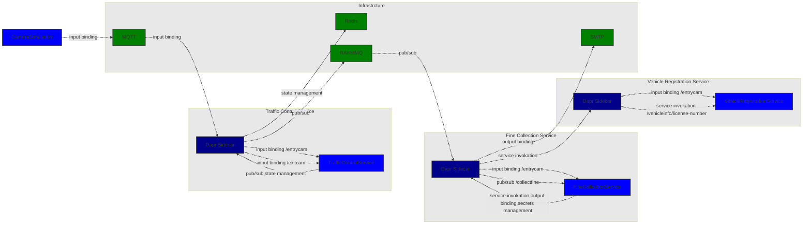

# AspireDTC

This project is to create a .NET Aspire preview3 version of the the original Dapr Traffic Control Sample. The original sample can be found [here](https://github.com/EdwinVW/dapr-traffic-control).

## Overall Architecture

The overall architecture of the system is shown below:

